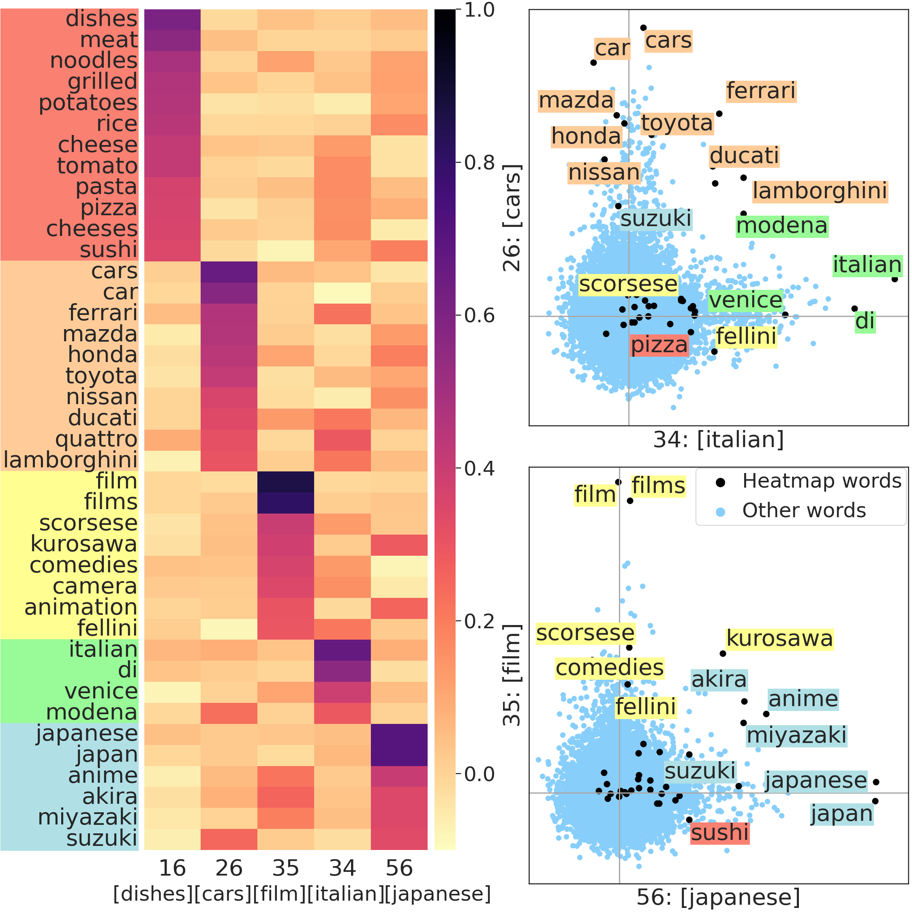
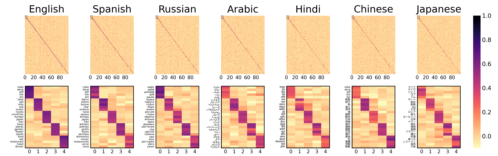
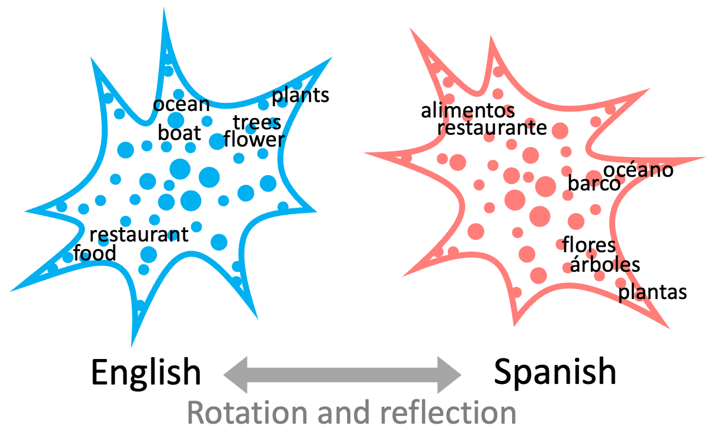
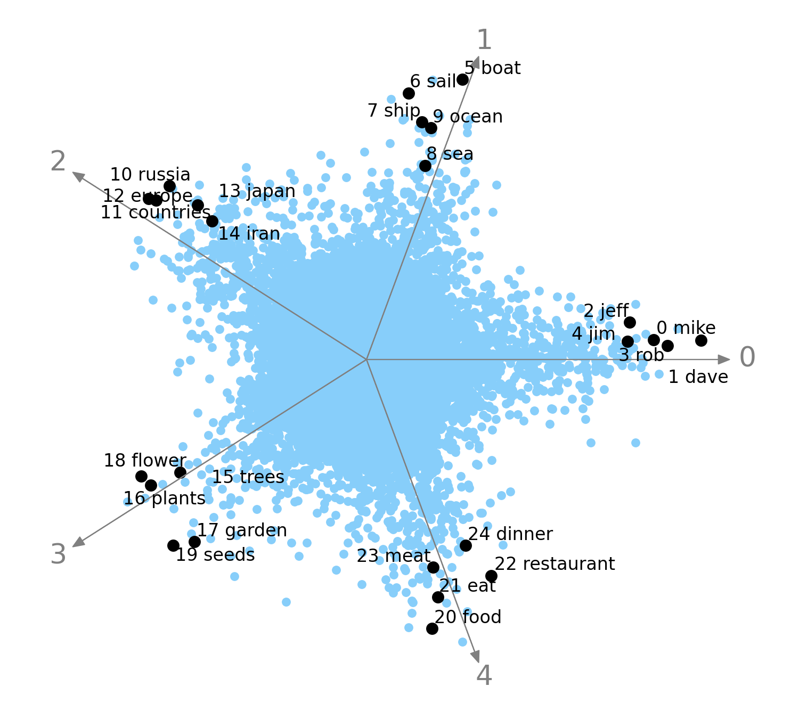
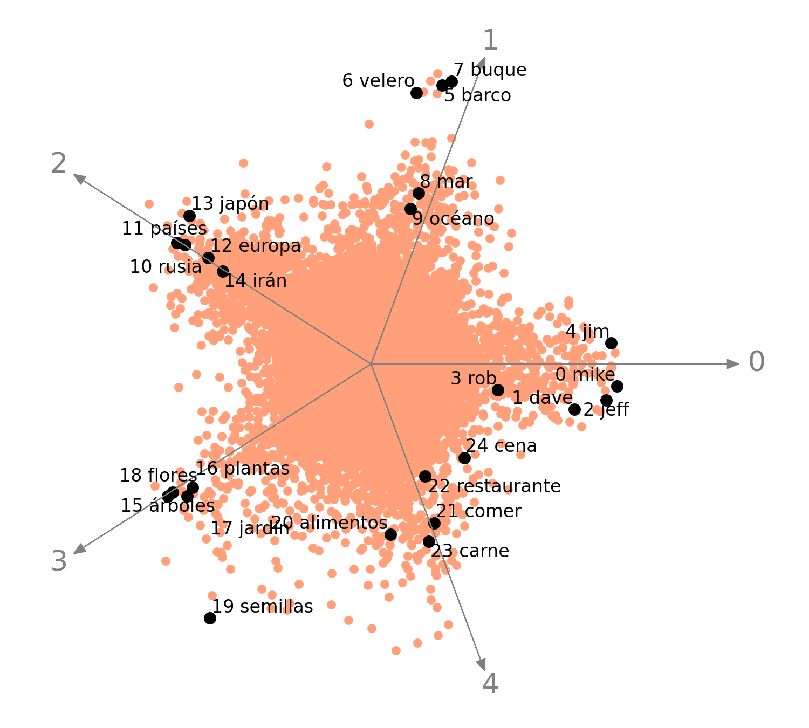
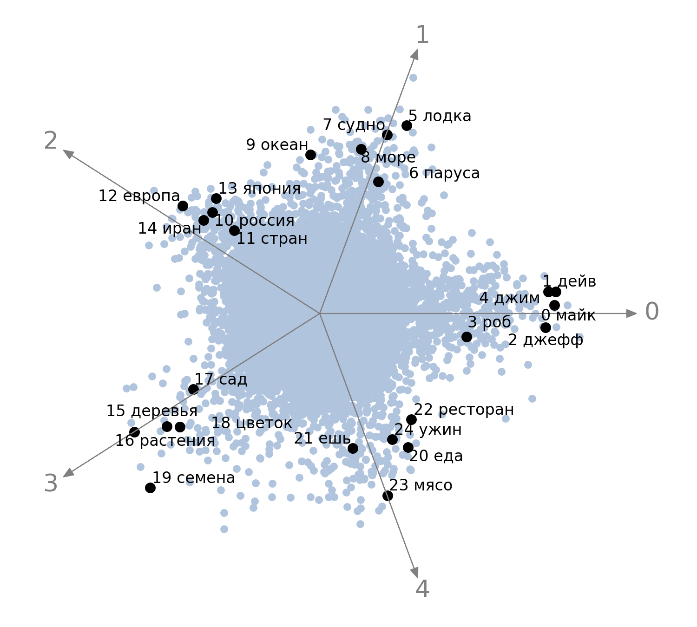
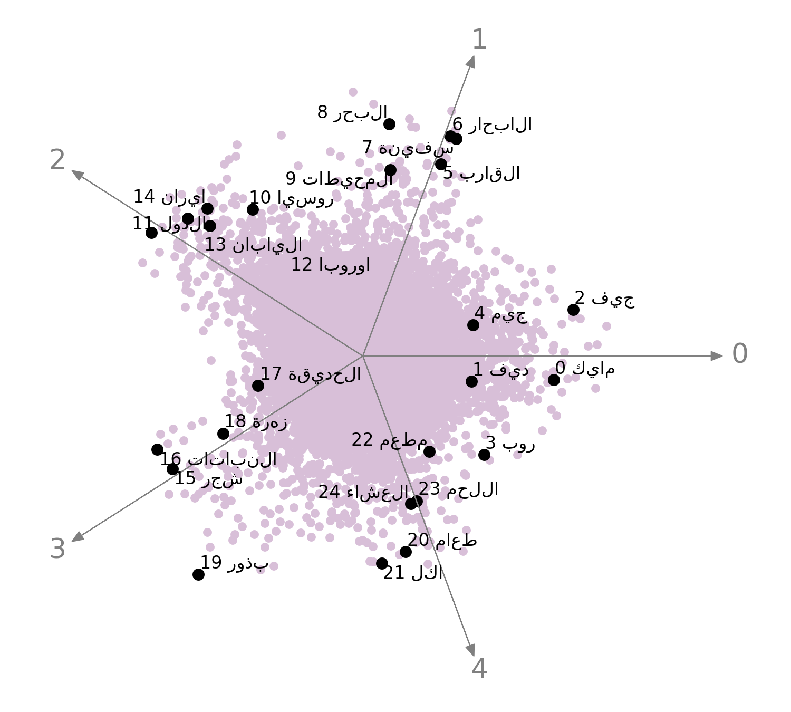
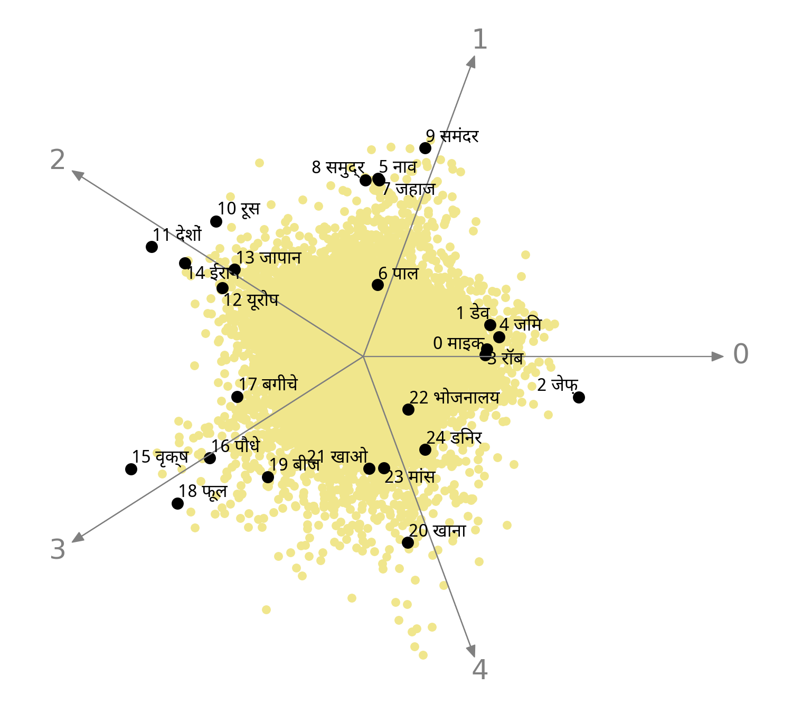
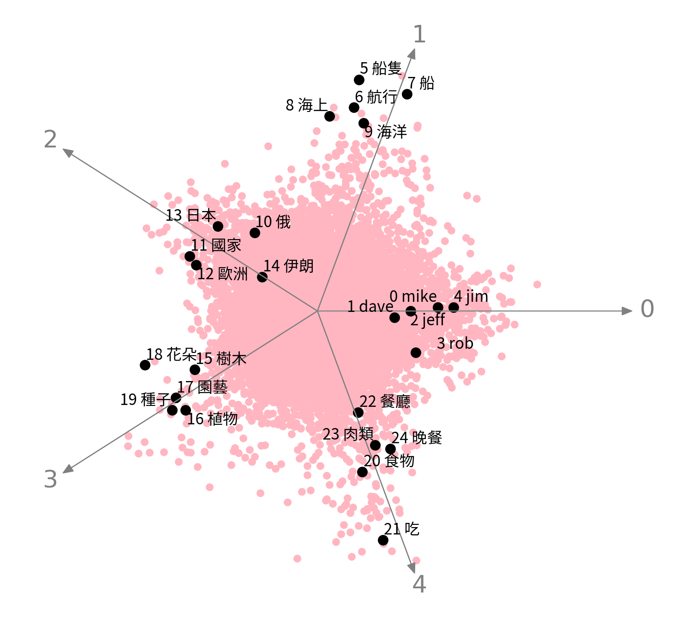
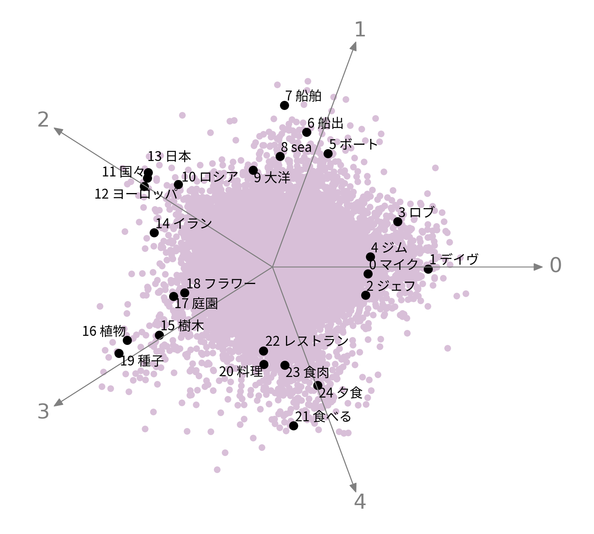

# Universal-Geometry-with-ICA

> [Discovering Universal Geometry in Embeddings with ICA](https://aclanthology.org/2023.emnlp-main.283/)                 
> [Hiroaki Yamagiwa](https://ymgw55.github.io/)\*, [Momose Oyama](https://momoseoyama.github.io/)\*, [Hidetoshi Shimodaira](http://stat.sys.i.kyoto-u.ac.jp/members/shimo/)                 
> *EMNLP 2023*

## English word embeddings

### Heatmap of ICA-transformed word embeddings




## Cross-lingual embeddings

### Heatmaps of ICA-transformed word embeddings



### Spiky shape of embedding distributions



### Scatter plots of  ICA-transformed word embeddings

<table>
  <tr>
    <th style="width: 50%;">English</th>
    <th style="width: 50%;">Spanish</th>
  </tr>
  <tr>
    <td></td>
    <td></td>
  </tr>
</table>

<table>
  <tr>
    <th style="width: 20%;">Russian</th>
    <th style="width: 20%;">Arabic</th>
    <th style="width: 20%;">Hindi</th>
    <th style="width: 20%;">Chinese</th>
    <th style="width: 20%;">Japanese</th>
  </tr>
  <tr>
    <td></td>
    <td></td>
    <td></td>
    <td></td>
    <td></td>
  </tr>
</table>

## Code and Data

- The code for English embeddings is currently being prepared.
- For cross-lingual embeddings, dynamic embeddings, and image model embeddings, please refer to the [universal](universal/) directory.


## Citation
If you find our code or data useful in your research, please cite our paper:
```
@inproceedings{DBLP:conf/emnlp/YamagiwaOS23,
  author       = {Hiroaki Yamagiwa and
                  Momose Oyama and
                  Hidetoshi Shimodaira},
  editor       = {Houda Bouamor and
                  Juan Pino and
                  Kalika Bali},
  title        = {Discovering Universal Geometry in Embeddings with {ICA}},
  booktitle    = {Proceedings of the 2023 Conference on Empirical Methods in Natural
                  Language Processing, {EMNLP} 2023, Singapore, December 6-10, 2023},
  pages        = {4647--4675},
  publisher    = {Association for Computational Linguistics},
  year         = {2023},
  url          = {https://aclanthology.org/2023.emnlp-main.283},
  timestamp    = {Wed, 13 Dec 2023 17:20:20 +0100},
  biburl       = {https://dblp.org/rec/conf/emnlp/YamagiwaOS23.bib},
  bibsource    = {dblp computer science bibliography, https://dblp.org}
}
```