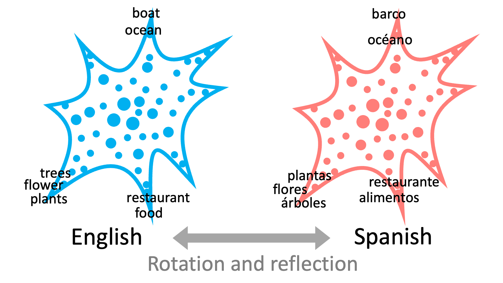

# Universal-Geometry-with-ICA

**Discovering Universal Geometry in Embeddings with ICA**

- Hiroaki Yamagiwa
- Momose Oyama
- Hidetoshi Shimodaira

## English word embeddings

### Heatmap of ICA-transformed word embeddings

## Cross-lingual embeddings

### Heatmaps of ICA-transformed word embeddings

### Spiky shape of embedding distributions

### Scatter plots of  ICA-transformed word embeddings

<table>
  <tr>
    <th style="width: 50%;">English</th>
    <th style="width: 50%;">Spanish</th>
  </tr>
  <tr>
    <td></td>
    <td></td>
  </tr>
</table>

<table>
  <tr>
    <th style="width: 20%;">Russian</th>
    <th style="width: 20%;">Arabic</th>
    <th style="width: 20%;">Hindi</th>
    <th style="width: 20%;">Chinese</th>
    <th style="width: 20%;">Japanese</th>
  </tr>
  <tr>
    <td></td>
    <td></td>
    <td></td>
    <td></td>
    <td></td>
  </tr>
</table>

## Paper

- [arxiv 2305.13175](https://arxiv.org/abs/2305.13175)
- EMNLP 2023 main

## Code and Data

in preparation
