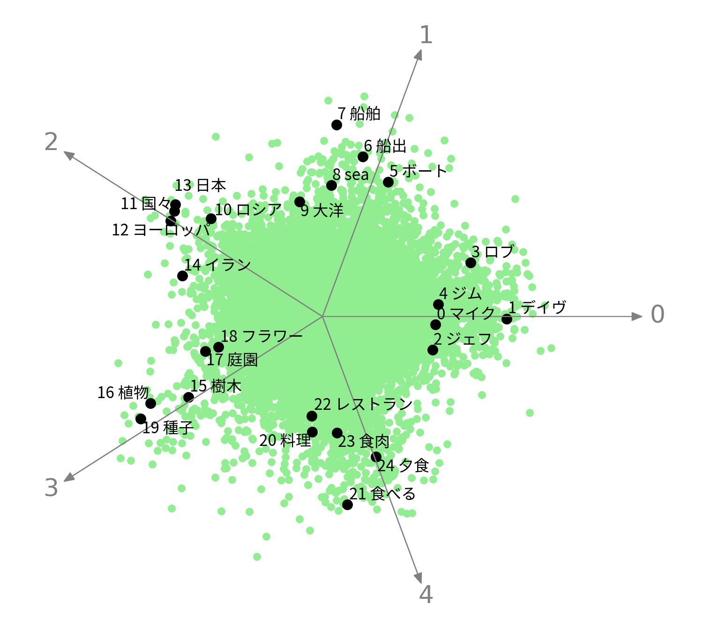

# Universal-Geometry-with-ICA

**Discovering Universal Geometry in Embeddings with ICA**

- Hiroaki Yamagiwa
- Momose Oyama
- Hidetoshi Shimodaira

## Overview of Cross-lingual embeddings

### Heatmaps of ICA-transformed word embeddings

### Spiky shape of embedding distributions

### Scatter plots of  ICA-transformed word embeddings

| English | Spanish |
| ------------- | ------------- |
|  |  |

| Russian | Arabic | Hindi | Chinese | Japanese |
| ------------- | ------------- | ------------- | ------------- | ------------- |
|  |  |  |  |  |

## Paper

- [arxiv 2305.13175](https://arxiv.org/abs/2305.13175)
- EMNLP 2023 main

## Code and Data

in preparation

