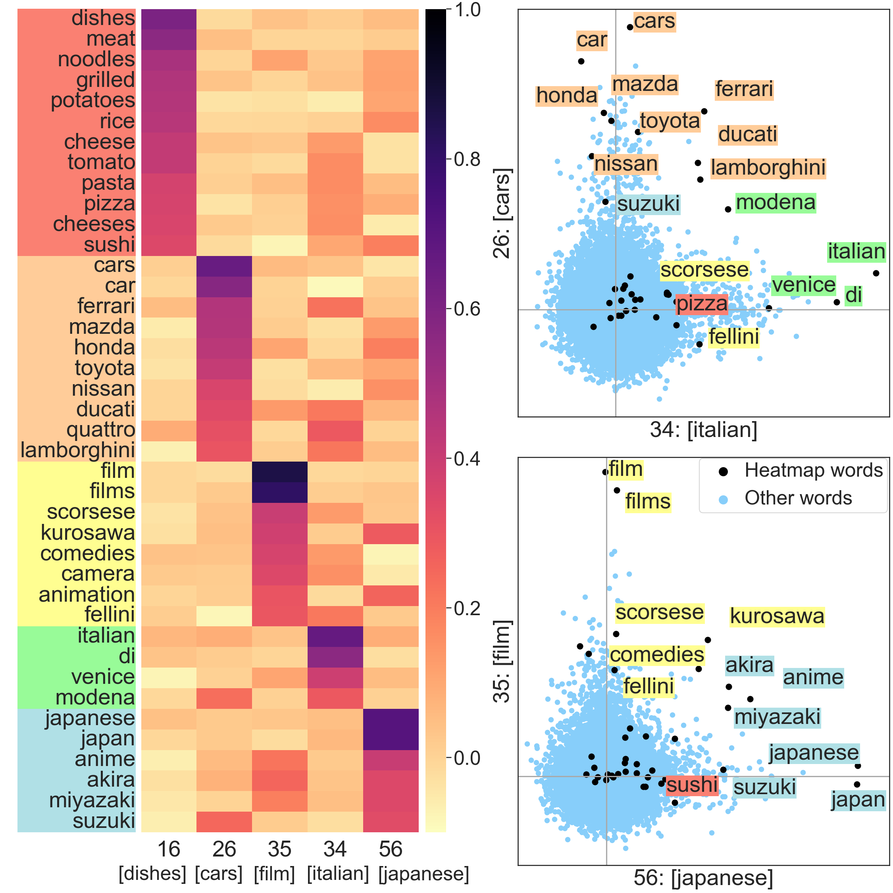
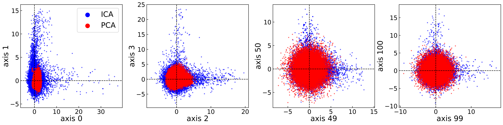
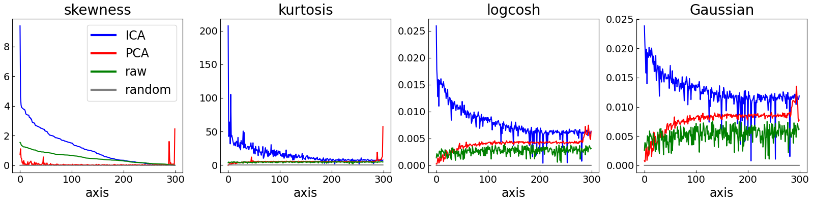
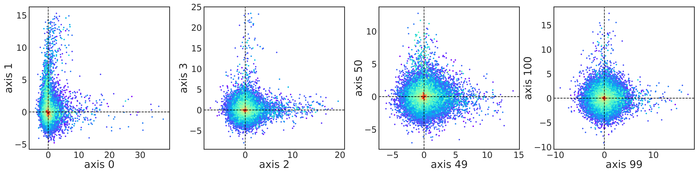

# Geometry of ICA-transformed Embeddings

This repository contains code for analyzing and visualizing the geometry of Independent Component Analysis (ICA) transformed word embeddings.

## Setup

1. Clone the repository:
   ```
   git clone https://github.com/shimo-lab/Universal-Geometry-with-ICA.git
   ```
2. Create a virtual environment (Python 3.10):
   ```
   python3.10 -m venv venv
   ```
3. Activate the virtual environment:
   - On Unix or MacOS:
     ```
     source venv/bin/activate
     ```
   - On Windows:
     ```
     venv\Scripts\activate
     ```
4. Install the required packages:
   ```
   pip install -r requirements.txt
   ```

## Data

The data required to run the code is located in the `data` folder. 
However, due to size constraints, two large datasets are hosted on Google Drive:

- Google Drive folder: [https://drive.google.com/drive/folders/1zI2uxDEbdkiEEMkjuyvnG_Y1mvVJBYC1?usp=drive_link](https://drive.google.com/drive/folders/1zI2uxDEbdkiEEMkjuyvnG_Y1mvVJBYC1?usp=drive_link)

Please download the following files from the Google Drive folder and place them in the appropriate directories:

1. `pca2_20230618_200633.pkl`: Download and place in the `data/ica_data` folder
2. `text8_sgns-Win_ep100`: Download and place in the `data/text8_sgns` folder

Ensure you have these datasets in place before running the scripts.

## Generating Figures

### Figure 1: Heatmap and Scatterplots of ICA-transformed Embeddings
**To generate:**
```
python fig1.py
```


**Description:** This figure shows a heatmap of normalized ICA-transformed word embeddings for selected axes, and scatterplots demonstrating how words are represented as combinations of axes.

### Figure 5: Scatterplots of Word Embeddings Along Specific Axes
**To generate:**
```
python fig5.py
```


**Description:** This figure displays scatterplots of word embeddings along the axes (0, 1), (2, 3), (49, 50), and (99, 100) for both ICA and PCA-transformed embeddings.

### Figure 6: Non-Gaussianity Measures
**To generate:**
```
python fig6.py
```


**Description:**
This figure shows the measures of non-Gaussianity for each axis of ICA and PCA-transformed word embeddings, as well as raw embeddings and a Gaussian random variable baseline.


### Figure 12: Scatter Plots of Normalized ICA-transformed Embeddings
**To generate:**
```
python fig12.py
```


**Description:** This figure presents scatter plots of the normalized ICA-transformed embeddings for ten combinations of five axes, highlighting words with colors corresponding to their respective axes.

### Figure 13: Scatter Plots with Word Frequency
**To generate:**
```
python fig13.py
```


**Description:** This figure shows scatter plots of **ICA**-transformed word embeddings along specific axes, with colors indicating word frequency in the corpus.


**Description:** This figure shows scatter plots of **PCA**-transformed word embeddings along specific axes, with colors indicating word frequency in the corpus.


## Computing ICA

The `ica.py` script performs Independent Component Analysis (ICA) on word embeddings. Here's a more detailed explanation of its functionality and usage:

### Key Features:
- Loads word embeddings and associated data
- Samples words based on their frequency
- Performs PCA for dimensionality reduction and whitening
- Applies FastICA algorithm
- Saves the results for further analysis

### Usage:
```
python ica.py --data_dir data/text8_sgns --max_iter [number_of_iterations]
```

### Parameters:
- `--data_dir`: Directory containing input data files (default: `data/text8_sgns`)
- `--output_dir`: Directory to save output files (default: `output`)
- `--seed`: Random seed for reproducibility (default: 4)
- `--alpha`: Power to raise the sampling weights to (default: 1)
- `--min_count`: Minimum count for a word to be considered (default: 10)
- `--num_row`: Number of words to sample (default: 100000)
- `--n_components`: Number of ICA components (default: None, which means all components)
- `--max_iter`: Maximum number of iterations for ICA (default: 10000)
- `--tol`: Tolerance for ICA convergence (default: 1e-10)

### Example:
For a quick trial with fewer iterations:
```
python ica.py --data_dir data/text8_sgns --max_iter 1000
```

### Output:
The script saves several pickle files in the `output/ica_data` directory:
- `wids_[timestamp].pkl`: List of word IDs used in the analysis
- `pca1_[timestamp].pkl`: PCA1 matrix
- `pca2_[timestamp].pkl`: PCA2 matrix (whitened)
- `R_ica_[timestamp].pkl`: ICA mixing matrix

### Note:
- The script provides progress updates during execution.
- Increasing `max_iter` may improve results but will increase computation time.
- Adjust `tol` for stricter or more lenient convergence criteria.

For more detailed information about the ICA process and its parameters, please refer to the script comments and associated documentation.