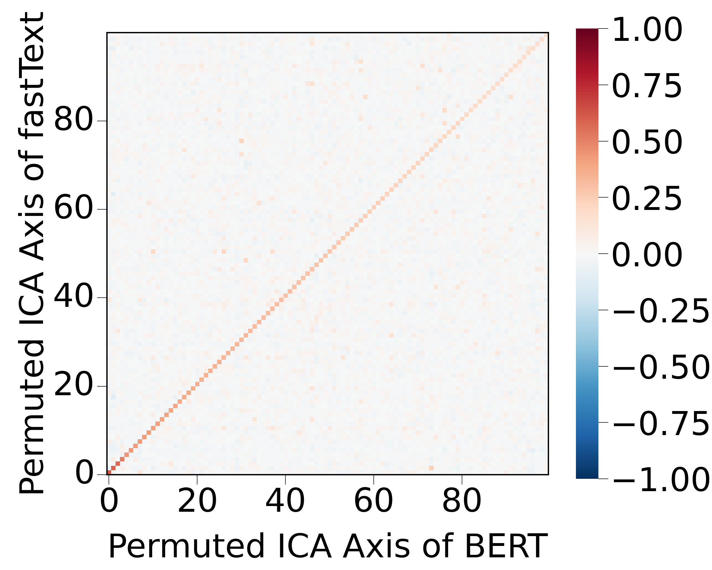
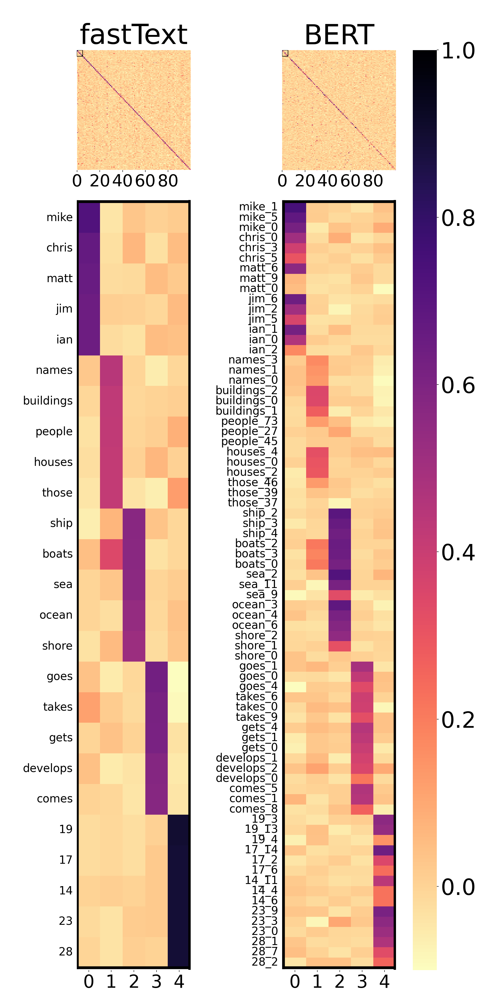

[English](README.md) | [日本語](README.ja.md)

# Universal Parts in [Universal-Geometry-with-ICA](https://github.com/shimo-lab/Universal-Geometry-with-ICA)

---

## Docker

<!-- TRANSLATION_START -->
This repository is intended to be run in a Docker environment. If you are not familiar with Docker, please set up an environment with torch==1.11.0 and install the packages listed in [requirements.txt](requirements.txt) accordingly.
<!--
このリポジトリは Docker 環境での実行を想定しています．Docker に不慣れな方は，`torch==1.11.0` の環境を用意し，[requirements.txt](requirements.txt) にあるパッケージを適切にインストールして下さい．
--->
<!-- TRANSLATION_END -->

###  Docker build

<!-- TRANSLATION_START -->
Please create a Docker image as follows:
<!--
次のようにして Docker image を作成して下さい．
--->
<!-- TRANSLATION_END -->

```bash
bash script/docker/build.sh
```

### Environment variable

<!-- TRANSLATION_START -->
Set the `DOCKER_HOME` environment variable to specify the path of the directory to be mounted as the home directory inside the Docker container.
<!--
環境変数 `DOCKER_HOME` を設定して、Docker コンテナ内のホームディレクトリとしてマウントするディレクトリのパスを指定します．
--->
<!-- TRANSLATION_END -->

```bash
$ export DOCKER_HOME="path/to/your/docker_home"
```


### Docker run

<!-- TRANSLATION_START -->
Run the Docker container by passing the GPU ID as an argument:
<!--
引数にGPU IDを渡して Docker コンテナを実行します：
--->
<!-- TRANSLATION_END -->

```bash
$ bash script/docker/run.sh 0
```

---

## Directory

<!-- TRANSLATION_START -->
The experiments described in the following sections should be performed in `src/`. 

Note, however, that the descriptions of file and directory locations are based on this directory.
<!--
次のセクション以降で説明する実験は，`src/` で実行して下さい．

ただし，ファイル・ディレクトリの位置の説明は，このディレクトリを基準に行う点に注意して下さい．
--->
<!-- TRANSLATION_END -->

---

## Cross-lingual Embeddings

<!-- TRANSLATION_START -->
The PCA-transformed and ICA-transformed embeddings used in the experiments are available. For details, please refer to the **Save Embeddings** section of this section.
<!--
実験に用いた PCA, ICA 変換済みの埋め込みを公開しています．
詳細はこのセクションの **Save Embeddings** を参照して下さい．
--->
<!-- TRANSLATION_END -->

### Datasets

#### 157 languages fastText

<!-- TRANSLATION_START -->
We used the 157 languages fastText [1]. Download the embeddings as follows:
<!--
私たちは 157 languages fastText [1] を使用しました．
次のようにして埋め込みをダウンロードします．
--->
<!-- TRANSLATION_END -->

```bash
./scripts/get_157langs_vectors.sh
```

<!-- TRANSLATION_START -->
Or manually download them from the following links:
<!--
もしくは以下から手動でダウンロードして下さい．
--->
<!-- TRANSLATION_END -->

[English](https://dl.fbaipublicfiles.com/fasttext/vectors-crawl/cc.en.300.vec.gz) | [Spanish](https://dl.fbaipublicfiles.com/fasttext/vectors-crawl/cc.es.300.vec.gz) | [Russian](https://dl.fbaipublicfiles.com/fasttext/vectors-crawl/cc.ru.300.vec.gz) | [Arabic](https://dl.fbaipublicfiles.com/fasttext/vectors-crawl/cc.ar.300.vec.gz) | [Hindi](https://dl.fbaipublicfiles.com/fasttext/vectors-crawl/cc.hi.300.vec.gz) | [Chinese](https://dl.fbaipublicfiles.com/fasttext/vectors-crawl/cc.zh.300.vec.gz) | [Japanese](https://dl.fbaipublicfiles.com/fasttext/vectors-crawl/cc.ja.300.vec.gz) | [French](https://dl.fbaipublicfiles.com/fasttext/vectors-crawl/cc.fr.300.vec.gz) | [German](https://dl.fbaipublicfiles.com/fasttext/vectors-crawl/cc.de.300.vec.gz) | [Italian](https://dl.fbaipublicfiles.com/fasttext/vectors-crawl/cc.it.300.vec.gz)

<!-- TRANSLATION_START -->
Please place the embeddings in `data/crosslingual/157langs/vectors/`.
<!--
`data/crosslingual/157langs/vectors/` に埋め込みを配置してください．
--->
<!-- TRANSLATION_END -->

#### MUSE fastText

<!-- TRANSLATION_START -->
We used MUSE [2] fastText. Download the embeddings as follows:
<!--
私たちは MUSE [2] fastText を使用しました．
次のようにして埋め込みをダウンロードします．
--->
<!-- TRANSLATION_END -->

```bash
./scripts/get_MUSE_vectors.sh
```

<!-- TRANSLATION_START -->
Or manually download them from the following links:
<!--
もしくは以下から手動でダウンロードして下さい．
--->
<!-- TRANSLATION_END -->

[English](https://dl.fbaipublicfiles.com/arrival/vectors/wiki.multi.en.vec) | [Spanish](https://dl.fbaipublicfiles.com/arrival/vectors/wiki.multi.es.vec) | [French](https://dl.fbaipublicfiles.com/arrival/vectors/wiki.multi.fr.vec) | [German](https://dl.fbaipublicfiles.com/arrival/vectors/wiki.multi.de.vec) | [Italian](https://dl.fbaipublicfiles.com/arrival/vectors/wiki.multi.it.vec) | [Russian](https://dl.fbaipublicfiles.com/arrival/vectors/wiki.multi.ru.vec)

<!-- TRANSLATION_START -->
Please place the embeddings in `data/crosslingual/MUSE/vectors/`.
<!--
`data/crosslingual/MUSE/vectors/` に埋め込みを配置してください．
--->
<!-- TRANSLATION_END -->

#### MUSE Dictionaries

<!-- TRANSLATION_START -->
We used the MUSE [2] dictionaries for word translations. Download the MUSE dictionaries as follows:
<!--
私たちは単語間の翻訳に MUSE [2] の辞書を使用しました．
次のようにして MUSE の辞書をダウンロードします．
--->
<!-- TRANSLATION_END -->

```bash
./scripts/get_MUSE_dictionaries.sh
```

<!-- TRANSLATION_START -->
For more details, please see the original repository [MUSE](https://github.com/facebookresearch/MUSE?tab=readme-ov-file#ground-truth-bilingual-dictionaries).
<!--
詳細については，元のレポジトリ [MUSE](https://github.com/facebookresearch/MUSE?tab=readme-ov-file#ground-truth-bilingual-dictionaries) を見て下さい．
--->
<!-- TRANSLATION_END -->

<!-- TRANSLATION_START -->
Please place the dictionaries files in `data/crosslingual/MUSE/dictionaries/`.
<!--
`data/crosslingual/MUSE/dictionaries/` に辞書のファイルを配置してください．
--->
<!-- TRANSLATION_END -->

#### Fonts

<!-- TRANSLATION_START -->
We used the following fonts:
<!--
私たちは以下のフォントを使用しました．
--->
<!-- TRANSLATION_END -->

- [NotoSansCJKjp-Regular.otf](https://github.com/notofonts/noto-cjk/blob/main/Sans/OTF/Japanese/NotoSansCJKjp-Regular.otf)
- [NotoSansDevanagari-VariableFont_wdth,wght.ttf](https://fonts.google.com/noto/specimen/Noto+Sans+Devanagari)

<!-- TRANSLATION_START -->
Please place the font files in `data/crosslingual/fonts/`.
<!--
`data/crosslingual/fonts/` にフォントファイルを配置してください．
--->
<!-- TRANSLATION_END -->

### Save Embeddings

#### PCA and ICA Transformation

<!-- TRANSLATION_START -->
Perform PCA and ICA transformations as follows:
<!--
次のようにして PCA 変換・ICA 変換を行います．
--->
<!-- TRANSLATION_END -->

```bash
python crosslingual_save_pca_and_ica_embeddings.py
```

<!-- TRANSLATION_START -->
Alternatively, embeddings for the following language sets used in the paper are available:
<!--
もしくは，論文中で用いた以下の言語の組の埋め込みが利用できます．
--->
<!-- TRANSLATION_END -->

- [en-es-ru-ar-hi-zh-ja (Google Drive)](https://drive.google.com/file/d/1ZK9c6iSu46AAqLjOYwfFUesnzhT1J_CN/view?usp=drive_link)
- [en-es-fr-de-it-ru (Google Drive)](https://drive.google.com/file/d/1UkRHaepZzPkeyY5S4ztY85DGOZqbFK09/view?usp=drive_link)

<!-- TRANSLATION_START -->
Please place the downloaded embedding directories under `output/crosslingual/` as in `output/crosslingual/en-es-ru-ar-hi-zh-ja/`.
<!--
`output/crosslingual/en-es-ru-ar-hi-zh-ja/` のように `output/crosslingual/` 以下にダウンロードした埋め込みのディレクトリを配置して下さい．
--->
<!-- TRANSLATION_END -->

### Figures

#### Axis Correlation

<table>
  <tr>
    <th style="width: 50%;">ICA</th>
    <th style="width: 50%;">PCA</th>
  </tr>
  <tr>
    <td></td>
    <td></td>
  </tr>
</table>

<!-- TRANSLATION_START -->
The figure above represents the correlations between the axes of the ICA-transformed embeddings of English and Spanish. Create the figure as follows:
<!--
上図は，ICA 変換後の英語とスペイン語の埋め込みについて，軸間の相関を表します．
次のようにして図を作成します．
--->
<!-- TRANSLATION_END -->

```bash
python crosslingual_show_axis_corr.py
```

<!-- TRANSLATION_START -->
For PCA transformation, please add the `--pca` option.
<!--
PCA 変換については，`--pca` オプションを追加して下さい．
--->
<!-- TRANSLATION_END -->

#### Normalized Embeddings Heatmap

<table>
  <tr>
    <th colspan="2" style="text-align:center;">ICA</th>
  </tr>
  <tr>
    <td></td>
  </tr>
</table>

<!-- TRANSLATION_START -->
The figure above is the heatmap of the normalized ICA-transformed embeddings for multiple languages. Create the figure as follows:
<!--
上図は，正規化された ICA 変換後の複数言語の埋め込みのヒートマップです．
次のようにして図を作成します．
--->
<!-- TRANSLATION_END -->

```bash
python crosslingual_show_embeddings_heatmap.py
```

<!-- TRANSLATION_START -->
For PCA transformation, please add the `--pca` option.
<!--
PCA 変換については，`--pca` オプションを追加して下さい．
--->
<!-- TRANSLATION_END -->

#### Correlation Scatterplots

<table>
  <tr>
    <th style="width: 50%;">ICA</th>
    <th style="width: 50%;">PCA</th>
  </tr>
  <tr>
    <td></td>
    <td></td>
  </tr>
</table>

<!-- TRANSLATION_START -->
The figure above is the scatterplot of the correlations between the axes matched by `crosslingual_show_embeddings_heatmap.py` for the ICA-transformed embeddings of English and other languages. Create the figure as follows:
<!--
上図は，ICA 変換後の英語とその他の言語の埋め込みについて，`crosslingual_show_embeddings_heatmap.py` で対応付けた軸間の相関の散布図です．
次のようにして図を作成します．
--->
<!-- TRANSLATION_END -->

```bash
python crosslingual_show_corr_scatter.py
```

<!-- TRANSLATION_START -->
For PCA transformation, please add the `--pca` option.
<!--
PCA 変換については，`--pca` オプションを追加して下さい．
--->
<!-- TRANSLATION_END -->

#### Scatterplots Projection

<table>
  <tr>
    <th colspan="2" style="text-align:center;">ICA</th>
  </tr>
  <tr>
    <th style="width: 50%;">English</th>
    <th style="width: 50%;">Spanish</th>
  </tr>
  <tr>
    <td></td>
    <td></td>
  </tr>
</table>

<!-- TRANSLATION_START -->
The figure above is the projection of the embedding space along the axes matched by `crosslingual_show_embeddings_heatmap.py` for the normalized ICA-transformed embeddings of multiple languages. Create the figure as follows:
<!--
上図は，正規化された ICA 変換後の複数言語の埋め込みについて，`crosslingual_show_embeddings_heatmap.py` で対応付けた軸に沿うように埋め込み空間を射影した図です．
次のようにして図を作成します．
--->
<!-- TRANSLATION_END -->

```bash
python crosslingual_show_scatter_projection.py
```

<!-- TRANSLATION_START -->
For PCA transformation, please add the `--pca` option.
<!--
PCA 変換については，`--pca` オプションを追加して下さい．
--->
<!-- TRANSLATION_END -->

<!-- TRANSLATION_START -->
If you are interested in the order of axes in ICA-transformed embeddings when projecting the embedding space, please see our related work [3].
<!--
埋め込み空間を射影する際，ICA 変換後の埋め込みの軸の順番に興味がある方は，私たちの関連研究 [3] を見てください．
--->
<!-- TRANSLATION_END -->

#### Log Skewness and Log Kurtosis

<table>
  <tr>
    <th colspan="2" style="text-align:center;">ICA</th>
  </tr>
  <tr>
    <td></td>
    <td></td>
  </tr>
</table>

<!-- TRANSLATION_START -->
The figure above shows the logarithmic values of skewness and kurtosis for each axis of the ICA-transformed embeddings of multiple languages. Create the figure as follows:
<!--
上図は，複数言語の ICA 変換後の埋め込みについて，軸ごとの skewness（歪度）と kurtosis (尖度) の対数の値です．
次のようにして図を作成します．
--->
<!-- TRANSLATION_END -->

```bash
python crosslingual_show_log_skew_and_kurt.py
```

<!-- TRANSLATION_START -->
For PCA transformation, please add the `--pca` option.
<!--
PCA 変換については，`--pca` オプションを追加して下さい．
--->
<!-- TRANSLATION_END -->

#### Scatterplots for Two Axes

<table>
  <tr>
    <th colspan="2" style="text-align:center;">ICA</th>
  </tr>
  <tr>
    <td></td>
    <td></td>
  </tr>
</table>

<!-- TRANSLATION_START -->
The figure above show the scatterplot when selecting two axes matched by `crosslingual_show_embeddings_heatmap.py` for ICA-transformed embeddings of multiple languages. Note that this figure is not in the paper. Create the figure as follows:
<!--
上図は，複数言語の ICA 変換後の埋め込みについて，`crosslingual_show_embeddings_heatmap.py` で対応付けた軸を2つ選んだ場合の散布図です．
論文中にはこの図はないことに注意して下さい．
次のようにして図を作成します．
--->
<!-- TRANSLATION_END -->

```bash
python crosslingual_show_scatter_plot.py
```
<!-- TRANSLATION_START -->
For PCA transformation, please add the `--pca` option.
<!--
PCA 変換については，`--pca` オプションを追加して下さい．
--->
<!-- TRANSLATION_END -->

### Alignment Task

<!-- TRANSLATION_START -->
When linear, orthogonal, PCA, and ICA transformations are applied to the embeddings, the performance of the alignment task between two languages is determined as follows:
<!--
埋め込みに対し，線形変換，直交変換，PCA 変換，ICA 変換を行った時，二言語間のアライメントタスクの性能は次のようにして求まります．
--->
<!-- TRANSLATION_END -->

```bash
python crosslingual_eval_alignment_task.py
```

<!-- TRANSLATION_START -->
Note that if [faiss](https://github.com/facebookresearch/faiss) is not installed, performance may decrease.
<!--
[faiss](https://github.com/facebookresearch/faiss) がインストールされていない場合，性能が下がる可能性がある点に注意して下さい．
--->
<!-- TRANSLATION_END -->

---

## Dynamic Embeddings

<!-- TRANSLATION_START -->
The PCA-transformed and ICA-transformed embeddings used in the experiments are available. For details, please refer to the **Save Embeddings** section of this section.
<!--
実験に用いた PCA, ICA 変換済みの埋め込みを公開しています．
詳細はこのセクションの **Save Embeddings** を参照して下さい．
--->
<!-- TRANSLATION_END -->

### Datasets

#### One Billion Word Benchmark

<!-- TRANSLATION_START -->
We used the One Billion Word Benchmark [4]. Please download it from the following link:
<!--
私たちは One Billion Word Benchmark [4] を使用しました．以下からダウンロードして下さい．
--->
<!-- TRANSLATION_END -->

- https://www.statmt.org/lm-benchmark/

<!-- TRANSLATION_START -->
Please place the data as in `data/dynamic/1-billion-word-language-modeling-benchmark-r13output/`.
<!--
`data/dynamic/1-billion-word-language-modeling-benchmark-r13output/` のようにデータを配置してください．
--->
<!-- TRANSLATION_END -->

### Save Embeddings

#### BERT Embeddings

<!-- TRANSLATION_START -->
Save the BERT embeddings as follows:
<!--
次のようにして BERT の埋め込みを保存します．
--->
<!-- TRANSLATION_END -->

```bash
python dynamic_save_raw_embeddings.py
```

#### PCA and ICA Transformation

<!-- TRANSLATION_START -->
Perform PCA and ICA transformations as follows:
<!--
次のようにして PCA 変換・ICA 変換を行います．
--->
<!-- TRANSLATION_END -->

```bash
python dynamic_save_pca_and_ica_embeddings.py
```

<!-- TRANSLATION_START -->
Alternatively, the BERT embeddings used in the paper are available:
<!--
もしくは，論文中で用いた BERT の埋め込みが利用できます．
--->
<!-- TRANSLATION_END -->

- [bert-base-uncased (Google Drive)](https://drive.google.com/file/d/18gVRvZq60ISEoJQvKnjrqy67TAP5P9b1/view?usp=drive_link)

<!-- TRANSLATION_START -->
Please place the downloaded embeddings under `output/dynamic/` as in `output/dynamic/bert-pca-ica-100000.pkl`.
<!--
`output/dynamic/bert-pca-ica-100000.pkl` のように `output/dynamic/` 以下にダウンロードした埋め込みを配置してください．
--->
<!-- TRANSLATION_END -->

### Figures

#### Axis Correlation

<table>
  <tr>
    <th style="width: 50%;">ICA</th>
    <th style="width: 50%;">PCA</th>
  </tr>
  <tr>
    <td></td>
    <td></td>
  </tr>
</table>

<!-- TRANSLATION_START -->
The figure above represents the correlations between the axes of the ICA-transformed fastText embeddings (calculated in **Cross-lingual Embeddings** section) and the ICA-transformed BERT embeddings. Create the figure as follows:
<!--
上図は ICA 変換後の fastText の埋め込み（**Cross-lingual Embeddings** で計算）と ICA 変換後の BERT の埋め込みに関する軸間の相関を表します． 次のようにして図を作成します．
--->
<!-- TRANSLATION_END -->

```bash
python dynamic_show_axis_corr.py
```

<!-- TRANSLATION_START -->
For PCA transformation, please add the `--pca` option.
<!--
PCA 変換については，`--pca` オプションを追加して下さい．
--->
<!-- TRANSLATION_END -->

#### Normalized Embeddings Heatmap

<table>
  <tr>
    <th style="width: 50%;">ICA</th>
    <th style="width: 50%;">PCA</th>
  </tr>
  <tr>
    <td></td>
    <td></td>
  </tr>
</table>

<!-- TRANSLATION_START -->
The figure above is the heatmap of the normalized ICA-transformed fastText embeddings (calculated in **Cross-lingual Embeddings** section) and the normalized ICA-transformed BERT embeddings. Create the figure as follows:
<!--
上図は，正規化された ICA 変換後の fastText の埋め込み（**Cross-lingual Embeddings** で計算）と正規化された ICA 変換後の BERT の埋め込みに関するヒートマップです． 
次のようにして図を作成します．
--->
<!-- TRANSLATION_END -->

```bash
python dynamic_show_embeddings_heatmap.py
```

<!-- TRANSLATION_START -->
For PCA transformation, please add the `--pca` option.
<!--
PCA 変換については，`--pca` オプションを追加して下さい．
--->
<!-- TRANSLATION_END -->

---

## Image Embeddings

<!-- TRANSLATION_START -->
The PCA-transformed and ICA-transformed embeddings used in the experiments are available. For details, please refer to the **Save Embeddings** section of this section.
<!--
実験に用いた PCA, ICA 変換済みの埋め込みを公開しています．
詳細はこのセクションの **Save Embeddings** を参照して下さい．
--->
<!-- TRANSLATION_END -->

### Datasets

#### ImageNet

<!-- TRANSLATION_START -->
We used ImageNet [5]. Please download it from the following link:
<!--
私たちは ImageNet [5] を使用しました．以下からダウンロードして下さい．
--->
<!-- TRANSLATION_END -->

- https://www.kaggle.com/c/imagenet-object-localization-challenge/data

<!-- TRANSLATION_START -->
If you can use [kaggle API](https://github.com/Kaggle/kaggle-api), please download as follows:
<!--
[kaggle API](https://github.com/Kaggle/kaggle-api) が使える方は次のようにしてダウンロードして下さい．
--->
<!-- TRANSLATION_END -->

```bash
kaggle competitions download -c imagenet-object-localization-challenge
mkdir -p data/image/imagenet/
unzip imagenet-object-localization-challenge.zip -d data/image/imagenet/
```

<!-- TRANSLATION_START -->
Please place the data as in `data/image/imagenet/`.
<!--
`data/image/imagenet/` のようにデータを配置してください．
--->
<!-- TRANSLATION_END -->

### Save Embeddings

#### Sample Images

<!-- TRANSLATION_START -->
Randomly sample 100 images per class as follows:
<!--
次のようにして 1 つのクラスにつき，100 枚の画像をランダムにサンプルします．
--->
<!-- TRANSLATION_END -->

```bash
python image_save_imagenet_100k.py
```

#### Image Model Embeddings

<!-- TRANSLATION_START -->
Save the image model embeddings as follows:
<!--
次のようにして画像モデルの埋め込みを保存します．
--->
<!-- TRANSLATION_END -->

```bash
python image_save_raw_embeddings.py
```

#### PCA and ICA Transformation

<!-- TRANSLATION_START -->
Perform PCA and ICA transformations as follows:
<!--
次のようにして PCA 変換・ICA 変換を行います．
--->
<!-- TRANSLATION_END -->

```bash
python image_save_pca_and_ica_embeddings.py
```

<!-- TRANSLATION_START -->
Alternatively, the image model embeddings used in the paper are available:
<!--
もしくは，論文中で用いた画像モデルの埋め込みが利用できます．
--->
<!-- TRANSLATION_END -->

- [vit_base_patch32_224_clip_laion2b (Google Drive)](https://drive.google.com/file/d/1OoWS5-C16juApOI7Fk3L3_H8AtOyRKT0/view?usp=drive_link)
- [resmlp_12_224 (Google Drive)](https://drive.google.com/file/d/1H04YDOv8ZYbE5TcR-i2aMY44Q_V_DpCt/view?usp=drive_link)
- [swin_small_patch4_window7_224 (Google Drive)](https://drive.google.com/file/d/1Mr5Xdvx1i1lc3zZwb59fNwaLbc2qwILF/view?usp=drive_link)
- [resnet18 (Google Drive)](https://drive.google.com/file/d/1t_DIF8YZ07u1PGpELvmmw5QXCFCqk0s4/view?usp=drive_link)
- [regnety_002 (Google Drive)](https://drive.google.com/file/d/1nQC3H5LXt4sxrYjJi2zo32X3NSvhJyA_/view?usp=drive_link)

<!-- TRANSLATION_START -->
Please place the downloaded embeddings under `output/image/` as in `output/image/vit_base_patch32_224_clip_laion2b-pca_ica.pkl`.
<!--
`output/image/vit_base_patch32_224_clip_laion2b-pca_ica.pkl` のように `output/image/` 以下にダウンロードした埋め込みファイルを配置してください．
--->
<!-- TRANSLATION_END -->

### Figures

#### Axis Correlation

<table>
  <tr>
    <th style="width: 50%;">ICA</th>
    <th style="width: 50%;">PCA</th>
  </tr>
  <tr>
    <td></td>
    <td></td>
  </tr>
</table>

<!-- TRANSLATION_START -->
The figure above represents the correlations between the axes of the ICA-transformed embeddings of image models. Create the figure as follows:
<!--
上図は，ICA 変換後の画像モデルの埋め込みについて，軸間の相関を表します． 次のようにして図を作成します．
--->
<!-- TRANSLATION_END -->

```bash
python image_show_axis_corr.py
```

<!-- TRANSLATION_START -->
For PCA transformation, please add the `--pca` option.
<!--
PCA 変換については，`--pca` オプションを追加して下さい．
--->
<!-- TRANSLATION_END -->

#### Normalized Embeddings Heatmap

<table>
  <tr>
    <th colspan="2" style="text-align:center;">ICA</th>
  </tr>
  <tr>
    <td></td>
  </tr>
</table>

<!-- TRANSLATION_START -->
The figure above is the heatmap of the normalized ICA-transformed fastText embeddings (calculated in **Cross-lingual Embeddings** section) and the normalized ICA-transformed embeddings of image models. Create the figure as follows:
<!--
上図は，正規化された ICA 変換後の fastText の埋め込み（**Cross-lingual Embeddings** で計算）と正規化された ICA 変換後の画像モデルの埋め込みに関するヒートマップです． 
次のようにして図を作成します．
--->
<!-- TRANSLATION_END -->

```bash
python image_show_embeddings_heatmap.py
```

<!-- TRANSLATION_START -->
For PCA transformation, please add the `--pca` option.
<!--
PCA 変換については，`--pca` オプションを追加して下さい．
--->
<!-- TRANSLATION_END -->

---

## References

### Code

<!-- TRANSLATION_START -->
We used publicly available repositories. We are especially grateful for the following two repositories. Thank you.
<!--
私たちは公開されているレポジトリを利用しました．特に以下の2つのリポジトリに感謝しています．ありがとうございました．
--->
<!-- TRANSLATION_END -->

- [MUSE](https://github.com/facebookresearch/MUSE?tab=readme-ov-file#ground-truth-bilingual-dictionaries)
- [WeightedCorr](https://github.com/matthijsz/weightedcorr)

### Paper

[1] Edouard Grave, Piotr Bojanowski, Prakhar Gupta, Armand Joulin, and Tomás Mikolov. Learning word vectors for 157 languages. LREC 2018.

[2] Guillaume Lample, Alexis Conneau, Marc’Aurelio Ranzato, Ludovic Denoyer, and Hervé Jégou. Word translation without parallel data. ICLR 2018.

[3] Hiroaki Yamagiwa, Yusuke Takase, and Hidetoshi Shimodaira. Axis Tour: Word Tour Determines the Order of Axes in ICA-transformed Embeddings. arXiv 2024.

[4] Ciprian Chelba, Tomás Mikolov, Mike Schuster, Qi Ge, Thorsten Brants, Phillipp Koehn, and Tony Robinson. One billion word benchmark for measuring progress in statistical language modeling. INTER-SPEECH 2014.

[5] Olga Russakovsky, Jia Deng, Hao Su, Jonathan Krause, Sanjeev Satheesh, Sean Ma, Zhiheng Huang, Andrej Karpathy, Aditya Khosla, Michael Bernstein, Alexander C. Berg, and Li Fei-Fei. IJCV 2015.


[6] Aapo Hyvärinen, and Erkki Oja. Neural networks 2000.

[7] Tomáš Musil, and David Mareček. Independent Components of Word Embeddings Represent Semantic Features. arXiv 2022.

## Note

<!-- TRANSLATION_START -->
- Since the URLs of published embeddings may change, please refer to the GitHub repository URL instead of the direct URL when referencing in papers, etc.
- This directory was created by [Hiroaki Yamagiwa](https://ymgw55.github.io/).
<!--
- 公開されている埋め込みの URL は変更される可能性があるので，論文などで参照する際は直接の URL ではなく，GitHub レポジトリの URL を参照して下さい．
- このディレクトリは [山際 宏明](https://ymgw55.github.io/) によって作成されました．
--->
<!-- TRANSLATION_END -->